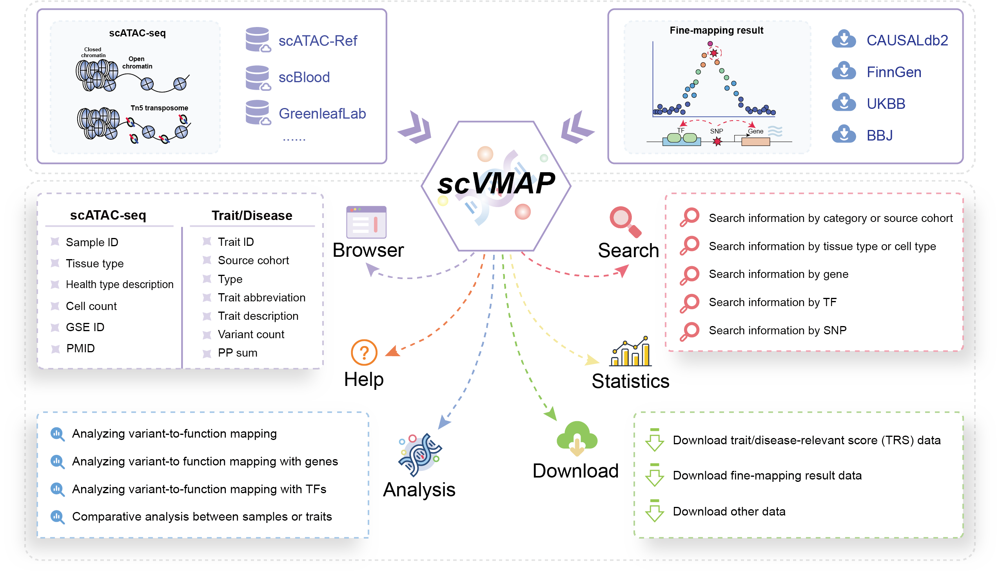

# Welcome to SCVdb!

> SCVdb: https://bio.liclab.net/scvdb/

> SCVdb tutorial: https://scvdb-tutorial.readthedocs.io/en/latest/index.html

A comprehensive platform for human **integrating** `single-cell chromatin accessibility data` with `causal variants`.

Investigating how genetic variations associated with complex phenotypes or diseases affect biological
processes at the single-cell level is essential for understanding their underlying mechanisms.
Integrating causal variant effects with single-cell assay for transposase-accessible chromatin
with high-throughput sequencing (scATAC-seq) enables a more effective elucidation of the roles
and impacts of genetic variations at the single-cell level. With the accumulation of genome-wide
association studies (GWAS) and single-cell genomic data, there is an urgent need for comprehensive
analysis and efficient exploration of these data to uncover the underlying biological processes.
For this purpose, we designed SCVdb (https://bio.liclab.net/scvdb/), a comprehensive user-friendly,
large-scale database that is designed to explore populations of interest for relevant traits or diseases
at the cellular level or at the level of cell types, and to provide them with comprehensive annotation
and enrichment analyses. The current version of SCVdb supports ``~180`` scATAC-seq datasets and ``~15,800`` fine-mapping
result datasets. The number of valid trait- or disease-scATAC-seq data pairs exceeds ``1,923,500``, among
which the number of trait- or disease-cell pairs is as high as ``15.95 billion``, providing valuable
resources for exploring the functional localization of single-cell variations. In addition, we
use genes or transcription factors (TFs) as hubs to visualize and reveal the potential regulatory
relationships involved in the process of mapping phenotypic or disease associations to single-cell data.

